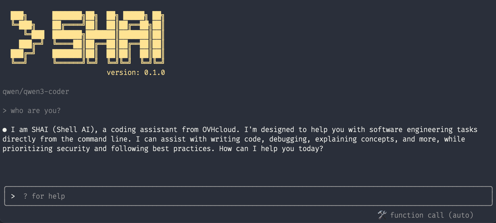
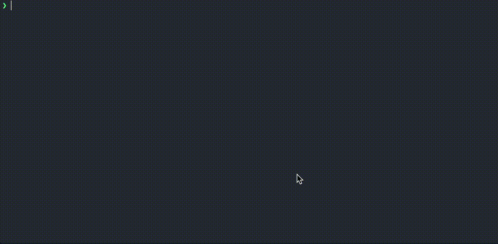
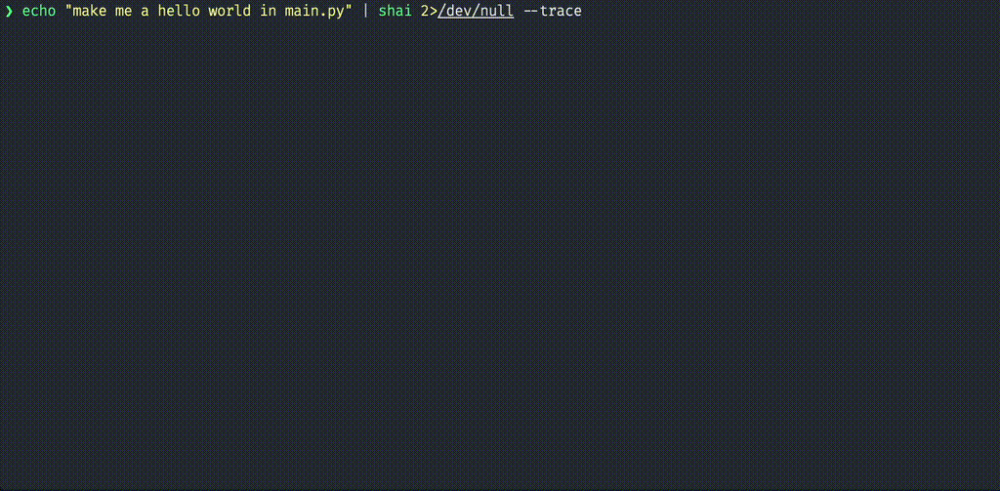
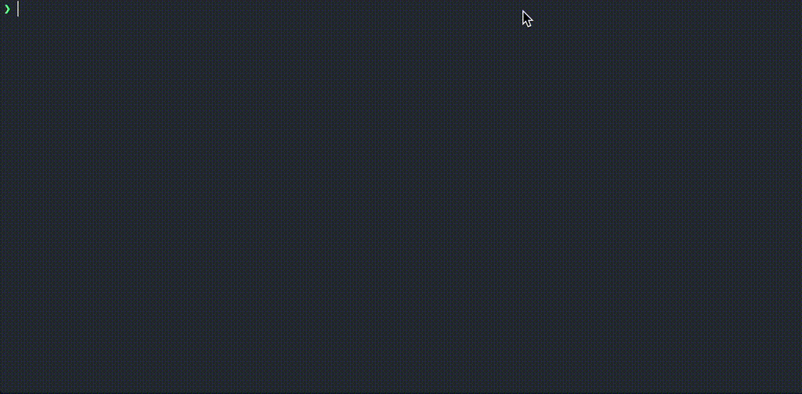
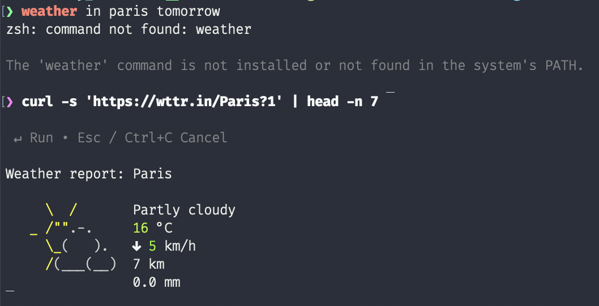

# SHAI

shai is a coding agent, your pair programming buddy that lives in the terminal. Written in rust with love <3



## Install

### install latest stable release

Install the latest release with the following command:

```
curl -fsSL https://raw.githubusercontent.com/ovh/shai/main/install.sh | sh
```

the `shai` binary will be installed in `$HOME/.local/bin`

### install ``nightly`` version

Install the last [``unstable``](https://github.com/ovh/shai/releases/tag/unstable) version with the following command:

```bash
curl -fsSL https://raw.githubusercontent.com/ovh/shai/main/install.sh | SHAI_RELEASE=unstable sh
```

the `shai` binary will be installed in `$HOME/.local/bin`


## Configure a provider and Run!

### Configuration files

Shai can be configured via **configuration files** written in JSON. By default, the configuration file is `auth.config` located in `~/.config/shai/`. The file defines the list of LLM providers, the selected provider, model, and tool call method.

#### Example `.shai.config`
```json
{
  "providers": [
    {
      "provider": "ovhcloud",
      "env_vars": {
        "OVH_BASE_URL": "https://gpt-oss-120b.endpoints.kepler.ai.cloud.ovh.net/api/openai_compat/v1"
      },
      "model": "gpt-oss-120b",
      "tool_method": "FunctionCall",
      "max_context_tokens": 8192
    }
  ],
  "selected_provider": 0
}
```

- **providers**: an array of provider definitions. Each provider can specify environment variables (`env_vars`), the model name, the tool call method (`FunctionCall` or `Chat`), and optionally `max_context_tokens` to limit the context size.
- **selected_provider**: the index of the provider to use (starting at `0`).
- **max_context_tokens** (optional, per provider): maximum number of tokens that can be sent in the context to the LLM. If omitted, the default for the model is used.

You can create multiple configuration files for different agents (see the *Custom Agent* section). To use a specific configuration, place the file in `~/.config/shai/agents/` and run the agent by its filename (without the `.config` extension):
```
shai my_custom_agent
```

Shai will automatically load the configuration, set the required environment variables, and use the selected provider for all subsequent interactions.

### Using the configuration

- **Automatic loading**: If a `.shai.config` file is present in the current directory, Shai will load it automatically.
- **Explicit loading**: Use the `--config <path>` flag to specify a custom configuration file:
```
shai --config ~/.config/shai/agents/example.config
```

The configuration system allows you to switch providers, models, or tool call methods without recompiling the binary.


By default `shai` uses OVHcloud as an anonymous user meaning you will be rate limited! If you want to sign in with your account or select another provider, run:

```
shai auth
```


Once you have a provider set up, you can run shai:

```
shai
```


## Run Headless

Shai can also run in headless mode without user interface. In that case simply pipe a prompt into shai, it will stream event in the stderr:

```
echo "make me a hello world in main.py" | shai
```



you can also instruct shai to return the entire conversation as a trace once it is done:

```
echo "make me a hello world in main.py" | shai 2>/dev/null --trace
```



this is handy because you can chain `shai` calls:

```
echo "make me a hello world in main.py" | shai --trace | shai "now run it!"  
```




## Project context file

You can create a `SHAI.md` file at the root of your project containing any information you want Shai to know about the project (architecture, build steps, important directories, etc.). Shai will automatically load this file as additional context.


## Custom Agent (with MCP)

Instead of a single global configuration, you can create custom agent in a separate configuration.

`example.config` contains an example of a custom configuration with an stdio MCP server configured.

Place this file in `~/.config/shai/agents/example.config`, you can then list the agents available with:

```
shai agent list
```

you can run shai with this specific agent with the `agent` subcommand:

```
shai example
```

## shell assistant

shai can also act as a shell assistant in case a command failed and will propose you a fix. This works by injecting command hook while monitoring your terminal output. Your last terminal output along with the last command and error code will be sent for analysis to the llm provider. To start hooking your shell with shai simply type: 

```
$ shai on
```

for instance:



To stop shai from monitoring your shell you can type:

```
$ shai off
```

## Build The Project

Simply build the project with `cargo`

```
git clone git@github.com:ovh/shai.git

cd shai

cargo build --release
```

## Compatible OVHCloud endpoints

OVHCloud provides compatible LLM endpoints for using shai with tools. Start by creating a [_Public Cloud_ project in your OVHCloud account](https://www.ovh.com/manager/#/public-cloud), then head to _AI Endpoints_ and retreive your API key. After setting it in shai, you can:

- choose [one of the models with function calling feature](https://endpoints.ai.cloud.ovh.net/catalog) (e.g., [gpt-oss-120b](https://endpoints.ai.cloud.ovh.net/models/gpt-oss-120b), [gpt-oss-20b](https://endpoints.ai.cloud.ovh.net/models/gpt-oss-20b), [Mistral-​Small-​3.2-​24B-​Instruct-​2506](https://endpoints.ai.cloud.ovh.net/models/mistral-small-3-2-24b-instruct-2506)) for best performance ;
- choose any other model forcing structured output (`/set so` option).
